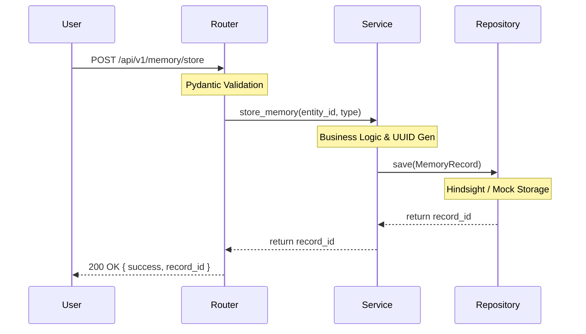

# Memory Agent (Agent 7) - Testing Guide

This document explains how to manually test the API and how the automated test suites work.

## 1. API Flow Architecture



## 2. Expected Results

For every endpoint, here is what you should expect:
- **POST `/store`**: 
  - *Response*: HTTP 200 with `{ "success": true, "record_id": "..." }`
  - *Database*: 1 new row/record inserted.
- **POST `/query`**: 
  - *Response*: HTTP 200 with an array of `records`.
  - *Database*: No change.
- **DELETE `/delete`**: 
  - *Response*: HTTP 200 with `{ "success": true }`.
  - *Database*: 1 record permanently removed.
- **GET `/health`**:
  - *Response*: HTTP 200 with `{ "status": "ok" }`.
  
## 3. Manual Testing

### Via Postman
1. Import `POSTMAN_COLLECTION.json`.
2. Import `POSTMAN_ENVIRONMENT.json`.
3. Select the "VORNIQ Local Environment".
4. Run the "Happy Path" folder in order.

### Via Swagger
1. Run the FastAPI server: `uvicorn main:app --reload`
2. Navigate to `http://127.0.0.1:8000/docs`
3. Expand the **Memory Agent** tag and use the "Try it out" button.

### Via cURL
```bash
curl -X POST "http://127.0.0.1:8000/api/v1/memory/health" -H "accept: application/json"
```

## 4. Automated Tests

The automated test suite uses `pytest` and `httpx` to verify endpoints directly.

### Execution
Run the following from the root directory:
```bash
pytest backend/agents/financial/memory/tests/ -v
```

### Coverage
- **Unit Tests**: Verifies that the `MemoryService` communicates correctly with the `MockRepository`.
- **API/Integration Tests**: Hits the FastAPI endpoints using a `TestClient` to verify HTTP status codes, JSON validation errors, and complete end-to-end routing.
- **Edge Cases**: Validates empty payloads and missing data structure fields.
